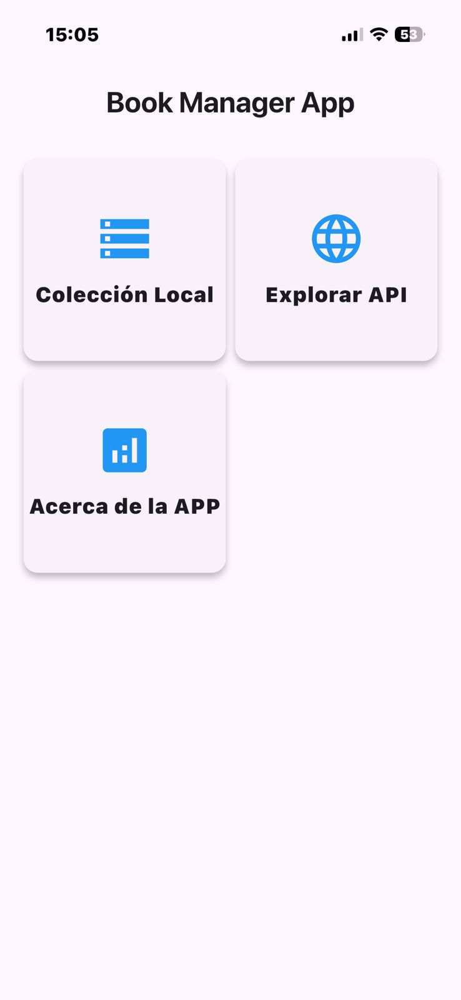
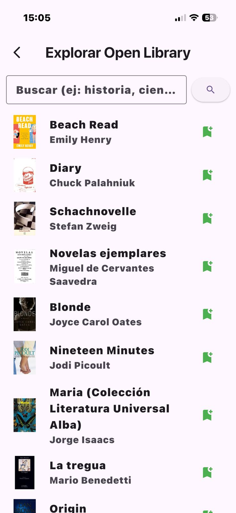
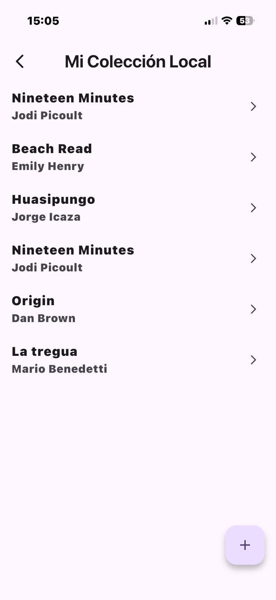
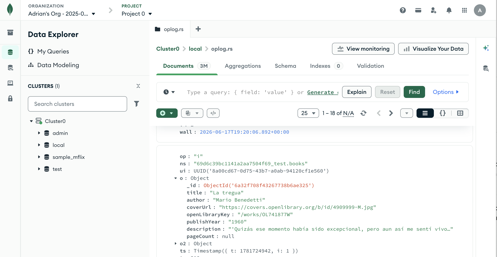

# 📚 Media Explorer App

Media Explorer App es una aplicación móvil desarrollada en Flutter que permite explorar libros mediante la API pública Open Library y administrar una colección personal almacenada en MongoDB Atlas.

La aplicación implementa un CRUD completo, navegación entre múltiples pantallas, carga progresiva (infinite scrolling) y persistencia en la nube.

## 🚀 Características

* 📖 Exploración de libros mediante la API de Open Library.
* ☁️ Almacenamiento y gestión de libros en MongoDB Atlas.
* 🔍 Búsqueda dinámica por título.
* ♾️ Infinite scrolling para carga progresiva de resultados.
* ➕ Agregar libros desde la API a la colección personal.
* ✏️ Editar registros almacenados.
* 🗑️ Eliminar libros con confirmación mediante AlertDialog.
* 📋 Visualización detallada de cada libro.
* 🌎 Traducción automática de descripciones al español.
* 📱 Interfaz adaptable y manejo de errores mediante SnackBar.

## 🖥️ Pantallas Implementadas

### HomePage

Pantalla principal con acceso a las funcionalidades de la aplicación.

### CollectionPage

Muestra los libros almacenados en MongoDB Atlas.

### FormPage

Permite crear y editar registros.

### DetailPage

Presenta información completa del libro:

* Título
* Autor
* Año de publicación
* Número de páginas
* Descripción
* Portada

### ApiExplorerPage

Explora libros desde Open Library mediante búsqueda e infinite scrolling.

### AboutPage

Información del proyecto, tecnologías utilizadas y desarrolladores.

## ⚙️ CRUD Implementado

#### Create

Crear libros manualmente y guardar libros provenientes de Open Library

#### Read

Listar y visualizar detalles

#### Update

Modificar información almacenada

#### Delete

Eliminar registros con confirmación

#### Detail

Mostrar información completa del libro


## 🛠 Tecnologías Utilizadas

* Flutter
* Dart
* MongoDB Atlas
* Open Library API
* package:http
* mongo_dart
* translator
* dart:convert

## 📂 Estructura del Proyecto

``` bash
lib/
│
├── models/
│   └── book_model.dart
│
├── mongodb/
│   └── mongo_service.dart
│
├── pages/
│   ├── home_page.dart
│   ├── collection_page.dart
│   ├── form_page.dart
│   ├── detail_page.dart
│   ├── api_explorer_page.dart
│   └── about_page.dart
│
└── main.dart
```

## 📦 Instalación

#### Clonar el repositorio

``` bash
git clone https://github.com/WilmerRamos21/MediaExplorer-App.git
cd media_explorer_app
```

#### Instalar dependencias

``` bash 
flutter pub get
```

#### Ejecutar la aplicación

``` bash 
flutter run
```

## 🔄 Funcionamiento General
``` bash 
Open Library API
        ↓
Búsqueda de libros
        ↓
Infinite Scrolling
        ↓
Obtención de detalles
        ↓
Traducción automática al español
        ↓
Guardado en MongoDB Atlas
        ↓
CRUD local
        ↓
Pantalla de detalles
```

## 📸 Evidencias

#### Pantalla principal


---

#### Explorador API


---

#### Colección Local


---

#### Detalle del libro


---

#### Formulario CRUD


---

#### Registros en MongoDB Atlas


---
## Desarrollador

Wilmer Ramos
Escuela de Formación de Tecnólogos (ESFOT)

## 📌 Nota

Aunque para fines académicos se realizó la conexión directa desde Flutter hacia MongoDB Atlas, en aplicaciones reales se recomienda utilizar un backend intermedio para proteger las credenciales y controlar el acceso a la base de datos.
